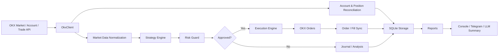

# OKX AI Quant

> Demo-first, risk-first OKX perpetual swap trading bot with AI-assisted reporting.


[中文文档](README.zh-CN.md) · [Risk Notice](RISK.md)

OKX AI Quant is a lightweight quant trading system for OKX perpetual swaps. It connects market data, strategy signals, risk controls, order execution, position reconciliation, SQLite audit logs, Telegram notifications, and AI-generated summaries in a readable Python codebase.

It is not a black-box money printer. It is an engineering foundation for learning, testing, and iterating on crypto trading systems. Start in OKX Demo Trading, inspect the logs, and only move toward live trading after you understand the entire execution path.

> Disclaimer: this project is not financial advice. Crypto trading is risky. Automated systems can lose money quickly because of strategy errors, network failures, API outages, slippage, liquidation, wrong configuration, or bugs. Read [RISK.md](RISK.md) before connecting any account.

---

## Why This Exists

Many trading bots sit at two extremes: tiny scripts with no accounting, or large frameworks that are hard to understand and modify.

OKX AI Quant aims for the middle:

- **Demo-first**: demo mode is the default; live trading requires an explicit opt-in.
- **Risk-first**: strategies find opportunities, but risk controls decide what is allowed.
- **Auditable**: signals, risk decisions, orders, fills, positions, balances, and reports are stored in SQLite.
- **Explainable**: deterministic explanations are always available, with optional OpenAI-compatible LLM summaries.
- **Extensible**: strategy, cost, risk, execution, notification, and reporting layers are separated.
- **Runnable**: CLI commands, an interactive menu, Telegram commands, and a long-running bot are included.

---

## Features

- Fetch OKX ticker data, funding rates, and `1H` / `4H` candles.
- Scan multiple OKX USDT perpetual swap instruments.
- Run seven built-in strategies across trend, momentum, breakout, mean-reversion, and cross-sectional styles.
- Estimate fees, slippage, and minimum expected move.
- Enforce risk limits for per-trade risk, daily loss, consecutive losses, max open positions, and leverage.
- Convert USDT notional into OKX contract size using instrument metadata such as `ctVal`, `lotSz`, and `minSz`.
- Configure cross or isolated margin, and set OKX leverage before entries.
- Reconcile local positions against real OKX exchange positions.
- Manage stop-loss, take-profit, reverse-signal, timeout, and risk exits for tracked positions.
- Check OKX market-data connectivity before opening new positions.
- Send scheduled and on-demand Telegram reports.
- Summarize equity, balances, positions, PnL, orders, risks, and recent failure logs with an optional LLM.
- Keep demo and live API credentials separate.
- Require `ALLOW_LIVE_TRADING=true` before live mode can run.

---

## Architecture



```text
src/okx_ai_quant/
  account.py       # OKX account and balance parsing
  bot.py           # long-running multi-symbol bot loop
  cli.py           # command line, menu, Telegram listener
  config.py        # .env settings and live-mode gate
  execution.py     # sizing, leverage setup, entries, exits
  llm.py           # OpenAI-compatible report summaries
  log_review.py    # recent failure-log review
  market_data.py   # ticker and candle normalization
  notifier.py      # console / Telegram / none
  okx_client.py    # python-okx adapter and retries
  reports.py       # trading overview rendering
  risk.py          # risk controls
  runner.py        # one-cycle orchestration
  storage.py       # SQLite persistence
  strategy.py      # built-in strategies and strategy factory
```

---

## Built-In Strategies

| Strategy | Type | What it looks for |
| --- | --- | --- |
| `ema-rsi-atr` | Trend following | `4H` and `1H` EMA alignment, RSI confirmation, ATR stop/target |
| `rsi-bollinger-reversion` | Mean reversion | Bollinger band extremes plus RSI overbought/oversold |
| `donchian-breakout` | Breakout | Recent channel breakout with `4H` trend confirmation |
| `ema-momentum` | Momentum | EMA direction and recent price momentum agree |
| `multi-timeframe-trend` | Multi-timeframe trend | `4H` and `1H` EMA stacks align |
| `volatility-adjusted-momentum` | Volatility-filtered momentum | Momentum must clear ATR noise |
| `cross-sectional-momentum-funding` | Cross-sectional momentum | Ranks the symbol universe, trades the strongest/weakest tails, filters expensive funding, and scales leverage down when volatility rises |

Every strategy returns `LONG`, `SHORT`, or `HOLD`.<br>
Even when a strategy returns `LONG` or `SHORT`, the order still needs to pass the risk guard before execution.

---

## Quick Start

### 1. Install

Requirements:

- Python 3.11+
- Git
- [`uv`](https://docs.astral.sh/uv/)
- OKX account and OKX Demo Trading API key
- Optional OpenAI-compatible LLM API key
- Optional Telegram bot token and chat id

```bash
git clone https://github.com/drasstry/okx-ai-quant.git
cd okx-ai-quant
uv sync
```

### 2. Configure

```bash
cp .env.example .env
```

Minimal demo configuration:

```dotenv
TRADING_MODE=demo
ALLOW_LIVE_TRADING=false

OKX_DEMO_API_KEY=your_demo_api_key
OKX_DEMO_API_SECRET=your_demo_api_secret
OKX_DEMO_API_PASSPHRASE=your_demo_api_passphrase

ENABLE_TRADING=false
STRATEGY_NAME=cross-sectional-momentum-funding
SYMBOLS=BTC-USDT-SWAP,ETH-USDT-SWAP,SOL-USDT-SWAP

REFERENCE_CAPITAL_USDT=1000
MAX_RISK_PER_TRADE=0.01
MAX_DAILY_LOSS=0.02
MAX_CONSECUTIVE_LOSSES=3
MAX_OPEN_POSITIONS=5
MAX_LEVERAGE=1
MARGIN_MODE=cross
```

Never commit `.env`. Keep API keys, LLM keys, and Telegram tokens in local or deployment secrets.

### 3. Test

```bash
uv run ruff check .
uv run pytest -q
```

### 4. Run Observe Mode

Observe mode fetches market data, creates signals, records risk decisions, and stores reports without submitting orders.

```bash
uv run okx-ai-quant bot --once --mode demo
```

Long-running observe mode:

```bash
uv run okx-ai-quant bot --mode demo
```

### 5. Enable Demo Trading

After market data, logs, reconciliation, and reports look sane:

```dotenv
TRADING_MODE=demo
ENABLE_TRADING=true
```

```bash
uv run okx-ai-quant bot --mode demo
```

One approved order for one symbol:

```bash
uv run okx-ai-quant run-once \
  --symbol BTC-USDT-SWAP \
  --strategy ema-rsi-atr \
  --mode demo \
  --submit
```

---

## CLI

```bash
# Help
uv run okx-ai-quant --help

# Interactive control console
uv run okx-ai-quant menu

# Guided one-off run
uv run okx-ai-quant wizard

# One multi-symbol bot cycle
uv run okx-ai-quant bot --once --mode demo

# Long-running bot
uv run okx-ai-quant bot --mode demo

# Send today's report now
uv run okx-ai-quant report-now --mode demo

# Listen for Telegram commands
uv run okx-ai-quant telegram-listen --mode demo

# One strategy cycle
uv run okx-ai-quant run-once --symbol BTC-USDT-SWAP --strategy ema-rsi-atr
```

Telegram commands:

- `/overview`
- `/report`
- `/daily`
- `/summary`
- `/status`
- `概览`, `日报`, `报告`, `总结`, `分析`

---

## Configuration

### Trading Mode

| Setting | Meaning |
| --- | --- |
| `TRADING_MODE=demo` | Default demo mode, using `OKX_DEMO_*` credentials |
| `TRADING_MODE=live` | Live mode, using `OKX_LIVE_*` credentials |
| `ALLOW_LIVE_TRADING=false` | Default live-trading lock |
| `ENABLE_TRADING=false` | Observe-only mode; no orders are submitted |

Live trading requires all of the following:

```dotenv
TRADING_MODE=live
ALLOW_LIVE_TRADING=true
ENABLE_TRADING=true
OKX_LIVE_API_KEY=your_live_key
OKX_LIVE_API_SECRET=your_live_secret
OKX_LIVE_API_PASSPHRASE=your_live_passphrase
```

### Risk Settings

| Setting | Default | Meaning |
| --- | --- | --- |
| `REFERENCE_CAPITAL_USDT` | `1000` | Reference capital for risk sizing |
| `MAX_RISK_PER_TRADE` | `0.01` | Maximum per-trade risk ratio |
| `MAX_DAILY_LOSS` | `0.02` | Maximum daily loss ratio |
| `MAX_CONSECUTIVE_LOSSES` | `3` | New-entry throttle after consecutive losses |
| `MAX_OPEN_POSITIONS` | `5` | Maximum simultaneous open positions |
| `MAX_LEVERAGE` | `1` | Maximum leverage cap used by the risk guard and OKX leverage setup |
| `MARGIN_MODE` | `cross` | OKX margin mode: `cross` or `isolated` |
| `OKX_ENTRY_HEALTHCHECK_*` | `5/5` | OKX market-data connectivity check before entries |

Risk controls block new entries. They should not block reduce-only exits for existing positions.

For strategies that do not recommend leverage, approved entries use `MAX_LEVERAGE`.
`cross-sectional-momentum-funding` recommends leverage from recent realized volatility:
lower volatility can use more leverage, higher volatility falls back toward `1x`, and
`MAX_LEVERAGE` remains the hard upper bound written to OKX before order submission.

### Telegram and LLM

```dotenv
NOTIFIER=telegram
TELEGRAM_BOT_TOKEN=your_bot_token
TELEGRAM_CHAT_ID=your_chat_id

LLM_ENABLED=true
LLM_PROVIDER=doubao
LLM_BASE_URL=https://ark.cn-beijing.volces.com/api/v3
LLM_API_KEY=your_llm_key
LLM_MODEL=doubao-seed-2-0-pro-260215
```

If Telegram needs a proxy but OKX should not inherit process-wide proxy environment variables:

```dotenv
TELEGRAM_PROXY_URL=http://host:port
```

The LLM is used for reports and explanations only. It is not part of deterministic risk evaluation. If no LLM key is configured, reports fall back to local templates.

---

## Reports

Scheduled and on-demand reports include:

- account equity and available balance
- current positions, direction, margin mode, and leverage
- estimated unrealized PnL and today's closed PnL
- order status overview
- risk state and key risk points
- recent OKX API, network, order, and Telegram failures
- optional LLM-generated Chinese trading summary

Default report schedule:

```dotenv
REPORT_TIMES=00:00,08:00,12:00,20:00
```

---

## Who This Is For

Good fit:

- builders learning quant trading system design
- strategy researchers using OKX Demo Trading for forward tests
- developers who want a small but complete bot foundation
- teams interested in LLM-assisted trading review and log summaries

Poor fit:

- anyone looking for guaranteed profit
- anyone unwilling to understand exchange APIs, margin, leverage, and contract sizing
- unattended live trading without monitoring
- environments where API/network/order failures are unacceptable

---

## Before Live Trading

At minimum, verify:

- OKX API keys have no withdrawal permission.
- API keys are bound to a stable IP allowlist.
- account mode, position mode, and margin mode match the code configuration.
- `ctVal`, `lotSz`, `minSz`, and minimum order size are correct for every instrument.
- demo trading has run for weeks with acceptable failure rate, slippage, fills, and reconciliation.
- network egress is stable enough for OKX APIs.
- Telegram and LLM failures do not affect the trading path.
- manual monitoring, stop procedures, log alerts, and recovery playbooks exist.
- live capital starts very small.

---

## Roadmap

- historical backtesting
- equity curves and per-strategy reporting
- exchange bills / realized PnL reconciliation
- multi-account and multi-strategy isolation
- finer network health checks and circuit breakers
- stronger kill switch
- web dashboard
- Docker and systemd deployment templates

---

## Contributing

Pull requests are welcome, especially for:

- risk controls and execution safety
- OKX API compatibility
- backtesting and reporting
- strategy research
- test coverage
- documentation and deployment experience

Keep the code readable, keep module boundaries clear, and add tests for trading-critical behavior.

---

## License

If this repository does not yet include a license file, confirm the license terms before using, distributing, or commercializing it.

---

## Final Warning

Trading systems fail in boring ways: network timeouts, bad assumptions, stale positions, wrong order sizes, account-mode mismatches, and tiny edge cases that only appear when money is live.

Demo first. Read the logs. Trust the exchange as the source of truth. Keep risk small.
