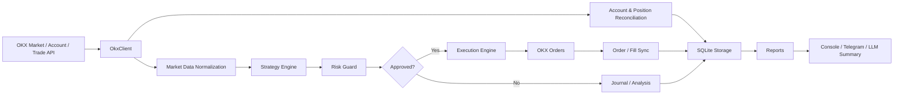

# OKX AI Quant

> Demo-first, risk-first OKX perpetual swap trading bot with AI-assisted reporting.


[English](README.md) · [风险提示](RISK.md)

OKX AI Quant 是一个面向 OKX 永续合约的轻量级量化交易系统。它把行情获取、策略信号、风控、订单执行、仓位同步、SQLite 审计日志、Telegram 通知和大模型总结放在一个可读、可测试、可逐步扩展的 Python 项目里。

它不是一个“黑箱自动赚钱机器人”。它更像一个工程化的量化交易底座：你可以先在 OKX 模拟盘验证策略和风控，再决定是否接入更严肃的交易环境。

> 免责声明：本项目不构成投资建议。Crypto 交易风险极高，自动化交易可能因为策略错误、网络抖动、API 异常、滑点、爆仓、配置失误或代码缺陷快速亏损。请先使用 OKX Demo Trading，并阅读 [RISK.md](RISK.md)。

---

## 为什么做这个项目

很多交易 bot 有两个极端：要么只是几行脚本，缺少仓位、风控和审计；要么是庞大的框架，上手和改造成本很高。

OKX AI Quant 选择中间路线：

- **先模拟盘**：默认 demo 模式，实盘需要显式解锁。
- **先风控**：策略只负责发现机会，风控决定能不能下单。
- **可审计**：信号、风控决策、订单、成交、仓位、报告都落到 SQLite。
- **可解释**：内置确定性解释，并可接入 OpenAI-compatible LLM 生成交易概览。
- **可扩展**：策略、成本模型、通知、执行层拆分清晰，适合继续改造。
- **可运行**：CLI、交互式菜单、Telegram 指令和长期 bot 进程都已具备。

---

## 核心能力

- 拉取 OKX ticker、资金费率、`1H` 和 `4H` K 线
- 支持多币种 USDT 永续合约扫描
- 内置 7 个策略：趋势、动量、突破、均值回归、横截面动量
- 估算手续费、滑点和最小预期波动
- 风控限制：单笔风险、日亏损、连续亏损、最大持仓数、最大杠杆
- 使用 OKX 合约元数据计算订单张数，避免把 USDT 名义金额误当作 `sz`
- 支持全仓 / 逐仓配置，并在开仓前设置 OKX 杠杆
- 按交易所真实持仓同步本地仓位，避免本地状态与 OKX 脱节
- 对已有仓位执行止损、止盈、反向信号、超时和风险退出
- 新开仓前做 OKX 行情连通性检查，网络异常时阻止扩大风险
- Telegram 定时报表和手动指令触发交易概览
- LLM 总结账户权益、持仓、盈亏、订单、风险点和失败日志
- demo/live API key 隔离，实盘必须 `ALLOW_LIVE_TRADING=true`

---

## 系统架构



```text
src/okx_ai_quant/
  account.py       # OKX 账户和余额解析
  bot.py           # 多币种长期运行 bot
  cli.py           # 命令行、菜单、Telegram listener
  config.py        # .env 配置和实盘保护
  execution.py     # 合约张数换算、杠杆设置、下单和平仓
  llm.py           # OpenAI-compatible LLM 总结
  log_review.py    # 失败日志复盘
  market_data.py   # 行情标准化
  notifier.py      # console / Telegram / none
  okx_client.py    # python-okx 适配和重试
  reports.py       # 交易概览渲染
  risk.py          # 风控规则
  runner.py        # 单周期编排
  storage.py       # SQLite 持久化
  strategy.py      # 策略工厂和内置策略
```

---

## 内置策略

| 策略名 | 类型 | 关注点 |
| --- | --- | --- |
| `ema-rsi-atr` | 趋势跟随 | `4H` 与 `1H` EMA 方向、RSI 确认、ATR 止损止盈 |
| `rsi-bollinger-reversion` | 均值回归 | 布林带边界 + RSI 超买超卖 |
| `donchian-breakout` | 突破 | 近期通道突破 + `4H` 趋势确认 |
| `ema-momentum` | 动量 | EMA 方向与近期价格动量一致 |
| `multi-timeframe-trend` | 多周期趋势 | `4H` 和 `1H` EMA stack 同向 |
| `volatility-adjusted-momentum` | 波动过滤动量 | 动量必须超过 ATR 噪声 |
| `cross-sectional-momentum-funding` | 横截面动量 | 对币种池按动量排序，交易最强/最弱尾部，用 funding 过滤拥挤方向，并在波动率升高时降低建议杠杆 |

每个策略只输出三类信号：`LONG`、`SHORT`、`HOLD`。<br>
即使策略给出 `LONG` 或 `SHORT`，订单也必须通过风控后才会进入执行层。

---

## 快速开始

### 1. 准备环境

要求：

- Python 3.11+
- Git
- [`uv`](https://docs.astral.sh/uv/)
- OKX 账号和 OKX Demo Trading API key
- 可选：OpenAI-compatible LLM API key
- 可选：Telegram Bot token 和 chat id

```bash
git clone https://github.com/drasstry/okx-ai-quant.git
cd okx-ai-quant
uv sync
```

### 2. 创建配置

```bash
cp .env.example .env
```

最小 demo 配置示例：

```dotenv
TRADING_MODE=demo
ALLOW_LIVE_TRADING=false

OKX_DEMO_API_KEY=your_demo_api_key
OKX_DEMO_API_SECRET=your_demo_api_secret
OKX_DEMO_API_PASSPHRASE=your_demo_api_passphrase

ENABLE_TRADING=false
STRATEGY_NAME=cross-sectional-momentum-funding
SYMBOLS=BTC-USDT-SWAP,ETH-USDT-SWAP,SOL-USDT-SWAP

REFERENCE_CAPITAL_USDT=1000
MAX_RISK_PER_TRADE=0.01
MAX_DAILY_LOSS=0.02
MAX_CONSECUTIVE_LOSSES=3
MAX_OPEN_POSITIONS=5
MAX_LEVERAGE=1
MARGIN_MODE=cross
```

不要提交 `.env`。真实 API key、LLM key、Telegram token 都应只保存在本地或安全的部署环境里。

### 3. 运行测试

```bash
uv run ruff check .
uv run pytest -q
```

### 4. 先跑观察模式

观察模式会拉行情、生成信号、记录风控决策和报告，但不会提交订单：

```bash
uv run okx-ai-quant bot --once --mode demo
```

长期运行：

```bash
uv run okx-ai-quant bot --mode demo
```

### 5. 开启模拟盘交易

确认行情、日志、仓位同步和报表都正常后，再打开 demo 下单：

```dotenv
TRADING_MODE=demo
ENABLE_TRADING=true
```

```bash
uv run okx-ai-quant bot --mode demo
```

单币种手动跑一次：

```bash
uv run okx-ai-quant run-once \
  --symbol BTC-USDT-SWAP \
  --strategy ema-rsi-atr \
  --mode demo \
  --submit
```

---

## 常用命令

```bash
# 查看帮助
uv run okx-ai-quant --help

# 交互式控制台
uv run okx-ai-quant menu

# 引导式单次运行
uv run okx-ai-quant wizard

# 多币种跑一个周期
uv run okx-ai-quant bot --once --mode demo

# 长期运行 bot
uv run okx-ai-quant bot --mode demo

# 立即生成并发送交易概览
uv run okx-ai-quant report-now --mode demo

# Telegram 指令监听
uv run okx-ai-quant telegram-listen --mode demo

# 只跑一个策略周期
uv run okx-ai-quant run-once --symbol BTC-USDT-SWAP --strategy ema-rsi-atr
```

Telegram 支持的消息：

- `/overview`
- `/report`
- `/daily`
- `/summary`
- `/status`
- `概览`、`日报`、`报告`、`总结`、`分析`

---

## 配置说明

### 交易模式

| 配置 | 说明 |
| --- | --- |
| `TRADING_MODE=demo` | 默认模拟盘模式，使用 `OKX_DEMO_*` |
| `TRADING_MODE=live` | 实盘模式，使用 `OKX_LIVE_*` |
| `ALLOW_LIVE_TRADING=false` | 默认禁止实盘 |
| `ENABLE_TRADING=false` | 默认观察模式，不提交订单 |

实盘必须同时满足：

```dotenv
TRADING_MODE=live
ALLOW_LIVE_TRADING=true
ENABLE_TRADING=true
OKX_LIVE_API_KEY=your_live_key
OKX_LIVE_API_SECRET=your_live_secret
OKX_LIVE_API_PASSPHRASE=your_live_passphrase
```

### 风控配置

| 配置 | 默认值 | 含义 |
| --- | --- | --- |
| `REFERENCE_CAPITAL_USDT` | `1000` | 风控参考资金，不一定等于账户权益 |
| `MAX_RISK_PER_TRADE` | `0.01` | 单笔最大风险比例 |
| `MAX_DAILY_LOSS` | `0.02` | 日内最大亏损比例 |
| `MAX_CONSECUTIVE_LOSSES` | `3` | 连续亏损后限制新开仓 |
| `MAX_OPEN_POSITIONS` | `5` | 最大同时持仓数 |
| `MAX_LEVERAGE` | `1` | 最大杠杆上限，风控和 OKX 杠杆设置都会使用 |
| `MARGIN_MODE` | `cross` | OKX 保证金模式：`cross` 或 `isolated` |
| `OKX_ENTRY_HEALTHCHECK_*` | `5/5` | 新开仓前 OKX 行情连通性检查 |

风控限制新开仓，不应阻止已有仓位的止损、止盈和 reduce-only 平仓。

没有建议杠杆的策略会直接使用 `MAX_LEVERAGE`。`cross-sectional-momentum-funding`
会按近期实现波动率给出建议杠杆：波动越低，允许的建议杠杆越高；波动升高时回落到接近
`1x`；最终仍由 `MAX_LEVERAGE` 做硬上限，并在下单前写入 OKX。

### Telegram 和 LLM

```dotenv
NOTIFIER=telegram
TELEGRAM_BOT_TOKEN=your_bot_token
TELEGRAM_CHAT_ID=your_chat_id

LLM_ENABLED=true
LLM_PROVIDER=doubao
LLM_BASE_URL=https://ark.cn-beijing.volces.com/api/v3
LLM_API_KEY=your_llm_key
LLM_MODEL=doubao-seed-2-0-pro-260215
```

如果你的 Telegram 需要代理，但不希望 OKX SDK 吃到全局代理环境变量，可以只给 Telegram 配：

```dotenv
TELEGRAM_PROXY_URL=http://host:port
```

LLM 只用于解释和总结，不参与确定性风控判断。没有 LLM key 时，系统会回退到本地模板总结。

---

## 报告长什么样

定时报告会覆盖：

- 账户权益和可用余额
- 当前持仓、方向、保证金模式、杠杆
- 估算浮盈浮亏和今日平仓盈亏
- 订单状态概览
- 风控状态和风险点
- 最近日志中的 API、网络、订单、Telegram 失败原因
- LLM 生成的中文交易总结

默认报告时间：

```dotenv
REPORT_TIMES=00:00,08:00,12:00,20:00
```

长期 bot 会在这些时间点自动发送报告；也可以通过 Telegram 指令随时触发。

---

## 适合谁使用

适合：

- 想学习量化交易系统工程结构的人
- 想基于 OKX Demo Trading 做 forward test 的策略开发者
- 想要一个小而完整的 bot 骨架继续改造的人
- 想把 LLM 用在复盘、日志解释和风险概览的人

不适合：

- 想找“开箱即赚钱”策略的人
- 不愿意理解交易所 API、保证金、杠杆和合约张数的人
- 希望无人值守直接上实盘的人
- 不能接受自动化系统出现网络/API/交易失败的人

---

## 上实盘前必须确认

至少完成这些检查：

- OKX API key 无提现权限
- API key 已绑定稳定 IP
- 交易账户模式、持仓模式、保证金模式与代码配置一致
- 每个交易品种的 `ctVal`、`lotSz`、`minSz`、最小下单量已验证
- demo 盘连续运行多周，失败率、滑点、成交、仓位同步都可接受
- 网络出口稳定，OKX API 连通性足够高
- Telegram/LLM 失败不会影响交易主链路
- 有人工监控、停止脚本、日志告警和灾难恢复方案
- 用非常小的资金开始，不要一开始就放大杠杆和仓位

---

## Roadmap

- 更完整的回测模块
- 资金曲线和策略分层报表
- 交易所 bills / realized PnL 对账
- 多账户和多策略隔离
- 更细粒度的网络健康检查与熔断
- 更完善的 kill switch
- Web dashboard
- Docker / systemd 部署模板

---

## Contributing

欢迎 PR，尤其是：

- 风控和交易执行安全性
- OKX API 兼容性
- 回测和统计报告
- 策略研究
- 测试覆盖
- 文档和部署体验

请尽量保持代码可读、模块边界清晰，并为关键交易行为补测试。

---

## License

如果仓库尚未添加许可证，请在使用、分发或商用前先确认授权边界。

---

## Final Warning

Trading systems fail in boring ways: network timeouts, bad assumptions, stale positions, wrong order sizes, account-mode mismatch, and tiny edge cases that only appear when money is live.

Demo first. Read the logs. Trust the exchange as source of truth. Keep risk small.
